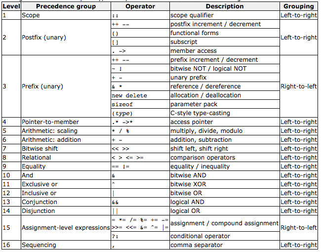

### 运算符优先级

### sizeof

<table>
	<tr>
		<td>type</td>
		<td>size(byte)</td>
		<td>note</td>
	</tr>
	<tr>
		<td>char</td>
		<td>1</td>
		<td></td>
	</tr>
	<tr>
		<td>string</td>
		<td>24</td>
		<td>无论是std::string, 还是include &lt;string&gt;都是24</td>
	</tr>
	<tr>
		<td>int</td>
		<td>4</td>
		<td></td>
	</tr>
	<tr>
		<td>short</td>
		<td>2</td>
		<td></td>
	</tr>
	<tr>
		<td>double</td>
		<td>8</td>
		<td></td>
	</tr>
	<tr>
		<td>long</td>
		<td>8</td>
		<td></td>
	</tr>
</table>